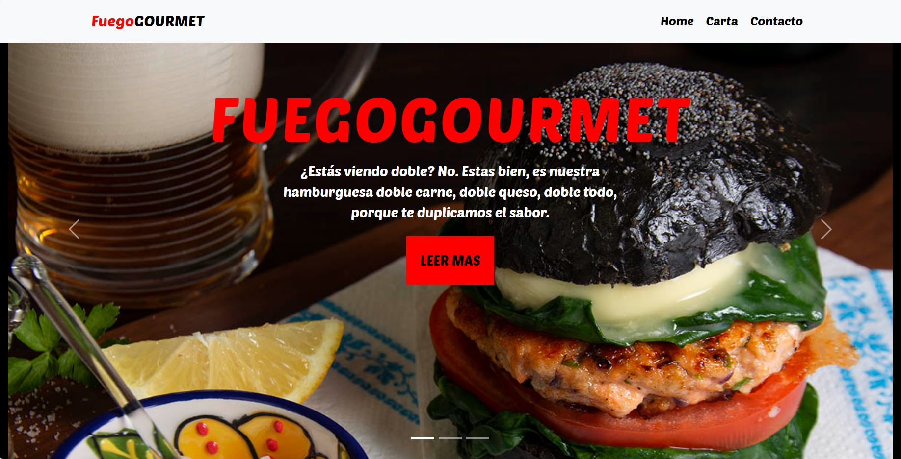
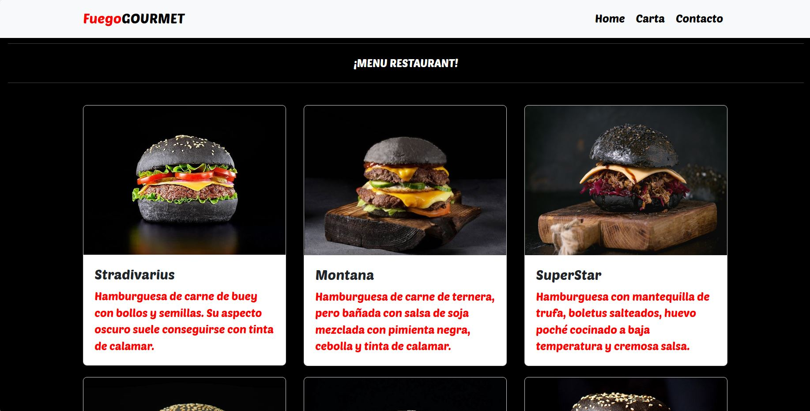
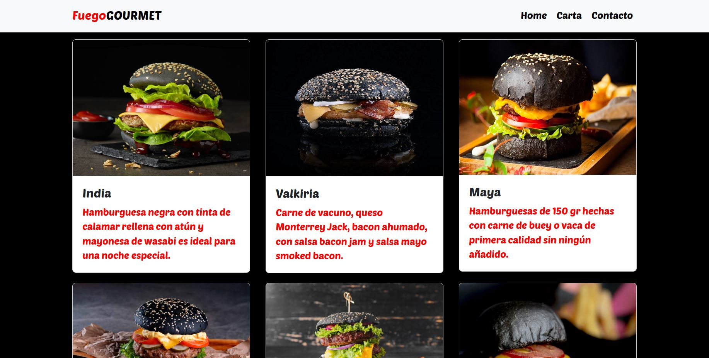
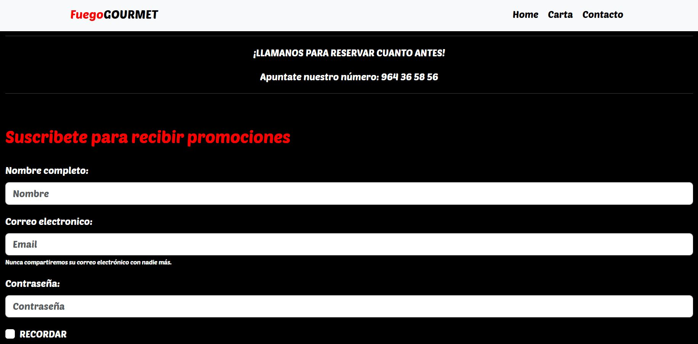
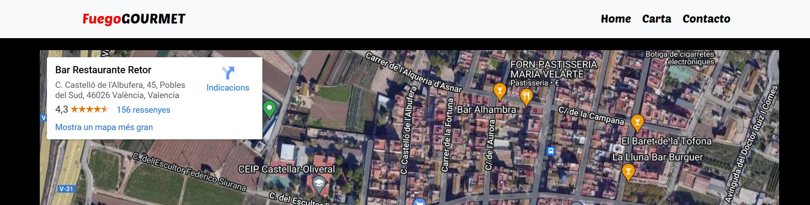

# FUEGOGOURMET🔥

## Table of Contents

- [Description](#description)
- [Design](#design️)
- [Webgrafia](#webgrafia)
- [Stack](#stack)
- [Author](#author)

## Description📚

My first project as part of Geekshubs consists of creating a responsive website using HTML5 + CSS Layout and Bootstrap components.

I have created a hamburger establishment where we can see an exquisite menu and we can opt for more features.

The establishment will be located in a small town in Valencia called Castellar Oliveral.

## Design🖋️

We have divided the website into four different pages. The main page, called "Home", has a navigation bar at the top and a carousel of images with their respective text where we can appreciate the quality of our food.

The "Carta" page will contain the restaurant's menu, in which we can see the different burgers that we have on cards taken from Bootstrap. They will be made up of your image, name and description.

The "Contact" page will provide us with information about the restaurant in addition to containing a form to qualify for promotions.

There will also be a map at the bottom showing the location of the establishment.

## Webgrafia

Resources with which I have completed the project:
 - [Bootstrap](https://getbootstrap.com/docs/5.3/getting-started/introduction/)
 - [Restaurant](https://abarrotes.es/)

## Stack

## Author

- **David Fernandez Valle**
  - [GitHub](https://github.com/Davfernandezz)

